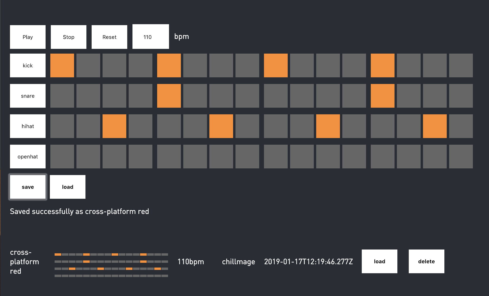

# Upbeat

[Live link!](https://blooming-dusk-15135.herokuapp.com/)

## Summary

A simple drum sequencer built in Node.js, featuring a RESTful API w/ CRUD operations to save, update and retrieve created drum patterns.

## Technologies

* HTML/CSS
* JavaScript
* jQuery
* Node.js
* Express
* Mongoose

## Screenshot

